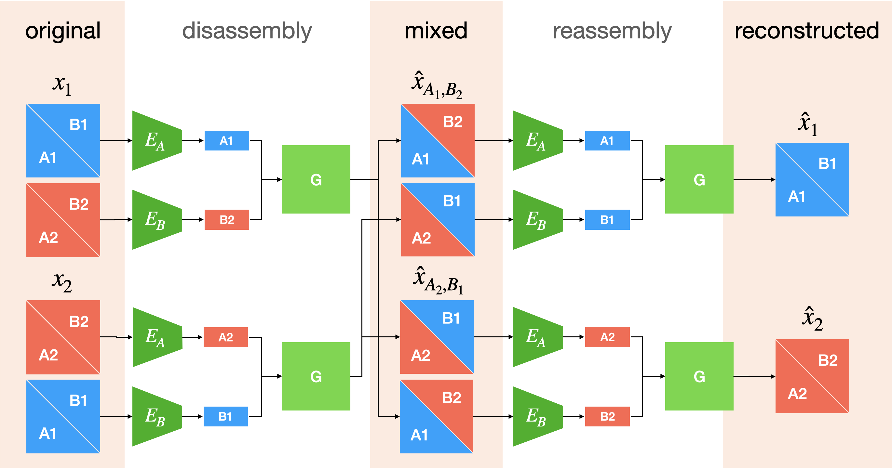

# G2G - Disentanglement by Cross-Training
Disentanglement is often considered as one of the most challenging tasks in modern machine learning. In this project, we propose the G2G architecture, which aims to solve the disentanglement task by cross-training: in a disassembly stage, the content and class information of two original images is separated. Subsequently, two images are generated by mixing the previously isolated information. This mixing process is then repeated in a reassembly stage. Ideally, the overall process should yield reconstructions that are similar to the original images. 

For a more detailed description of the project please view the [project report](report/report.pdf). This is a student project which I conducted in collaboration with Li Nguyen. View [her repository](https://github.com/nichtwegzudenken/ml4cg) for another implementation approach of the G2G architecture. Please note that this project is still a "work in progress". 



## Setup

Execute the following steps to set the project up. Consider activating your virtual environment first. 

```bash
git clone git@github.com:axkoenig/ml4cg.git
pip install -r requirements.txt
mkdir ml4cg/models
```

Now download the pretrained ResNet-50 face recognition network from [here](http://www.robots.ox.ac.uk/~vgg/data/vgg_face2/models/pytorch/resnet50_ft_pytorch.tar.gz) and place it in the ```ml4cg/models``` directory. It is part of the [official VGGFace2 repository](https://github.com/ox-vgg/vgg_face2). Download the [CelebA](http://mmlab.ie.cuhk.edu.hk/projects/CelebA.html) dataset and place it in a convenient location. The default logger of this project is [wandb](https://www.wandb.com). Create an account if you don't have one yet and login with the below command. If you have trouble follow [these](https://docs.wandb.com/quickstart) steps. Thanks to PyTorch Lightning it is easy to change the logger to TensorBoard for example (have a look [here](https://pytorch-lightning.readthedocs.io/en/latest/loggers.html) for more information). 

```bash
cd ml4cg
wandb login
```

## Training

To train the model run the following command. You need to change the data root to wherever you placed the dataset. Consider running ```python train.py -h``` to get more information about the supported command line arguments.
```bash
python train.py --data_root="my_data_root" --log_name="my_test" --gpus=4 --batch_size=8
```

## Acknowledgments
We would like to thank Ron Mokady, Daniel Cohen-Or, and Yotam Nitzan for their ongoing support during the Machine Learning Applications for Computer Graphics workshop at Tel Aviv University. We hope to stay in touch in the future and extend this project further in collaboration with you. Furthermore, we would like to thank the authors of the following papers.

- Liu, Ming-Yu, et al. "Few-shot unsupervised image-to-image translation." Proceedings of the IEEE International Conference on Computer Vision. 2019.
- Gabbay, Aviv, and Yedid Hoshen. "Demystifying inter-class disentanglement." International Conference on Learning Representations. 2019.
- Zhu, Jun-Yan, et al. "Unpaired image-to-image translation using cycle-consistent adversarial networks." Proceedings of the IEEE international conference on computer vision. 2017.
- Cao, Qiong, et al. "Vggface2: A dataset for recognising faces across pose and age." 2018 13th IEEE International Conference on Automatic Face & Gesture Recognition (FG 2018). IEEE, 2018.